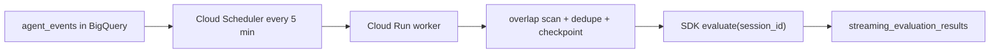
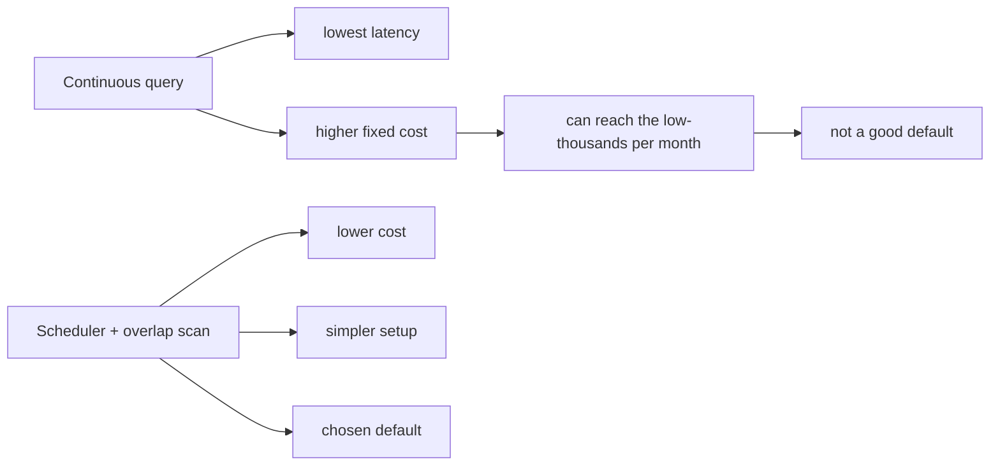

# Streaming Evaluation Deployment

This deployment path turns selected recent rows in `agent_events` into
session-scoped SDK evaluations with a scheduled overlap scan.



## What Launches

- terminal rows: `event_type = 'AGENT_COMPLETED'`
- error rows: `event_type = 'TOOL_ERROR' OR (status = 'ERROR' AND error_message IS NOT NULL)`
- evaluator profile: `streaming_observability_v1`
- default cadence: every `5` minutes
- default overlap window: `15` minutes
- default result table: `PROJECT.DATASET.streaming_evaluation_results`

## Why This Path

This launch path intentionally does **not** use BigQuery continuous
queries.



## Prerequisites

- `gcloud`, `bq`, and `jq`
- a BigQuery dataset containing `agent_events`
- permission to deploy Cloud Run and Cloud Scheduler in the target project

No special BigQuery reservation is required for this deployment path.
The setup script can enable the required Cloud Run, Cloud Build,
Artifact Registry, and Cloud Scheduler APIs automatically.

## Quick Start

```bash
cd deploy/streaming_evaluation
./setup.sh up my-project agent_trace agent_events us-central1
```

The script will:

- infer the BigQuery dataset location
- create the result table in the source dataset
- create hidden checkpoint and run-history tables
- deploy the `bq-agent-streaming-eval` Cloud Run service
- create the Cloud Scheduler job that invokes it every `5` minutes
- print the final result table name and a sample query

After setup, read results directly from BigQuery:

```sql
SELECT *
FROM `my-project.agent_trace.streaming_evaluation_results`
ORDER BY processed_at DESC
LIMIT 20;
```

## Hidden Internal State

The setup path also creates internal tables for recovery and debugging:

- `_streaming_eval_state`
- `_streaming_eval_runs`

These are implementation details. The primary user-facing table remains
`streaming_evaluation_results`.

## Cleanup

```bash
cd deploy/streaming_evaluation
./setup.sh down
```

`down` deletes the Cloud Scheduler job, removes the Cloud Run service,
removes the scheduler service account only if this setup created it, and
deletes the local state file.

`down` intentionally preserves the BigQuery tables:

- `streaming_evaluation_results`
- `_streaming_eval_state`
- `_streaming_eval_runs`

This keeps prior evaluation output and internal audit history queryable
after the deployment is removed. If you want to drop them too, remove
them manually with `bq rm -t`.

## Customization

Defaults can be overridden with environment variables before running
`setup.sh`:

- `PROJECT_ID`
- `DATASET_ID`
- `SOURCE_TABLE`
- `RUN_REGION`
- `RESULT_TABLE`
- `STATE_TABLE`
- `RUNS_TABLE`
- `POLL_SCHEDULE`
- `OVERLAP_MINUTES`
- `INITIAL_LOOKBACK_MINUTES`

`RESULT_TABLE` defaults to the same dataset as the source table so the
result sink stays in the same BigQuery location.
