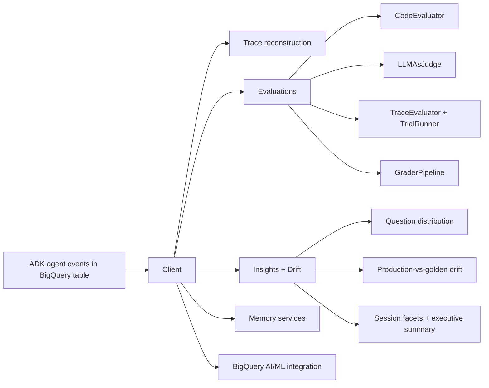
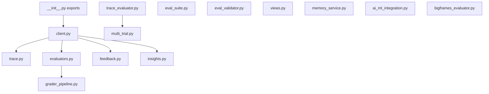
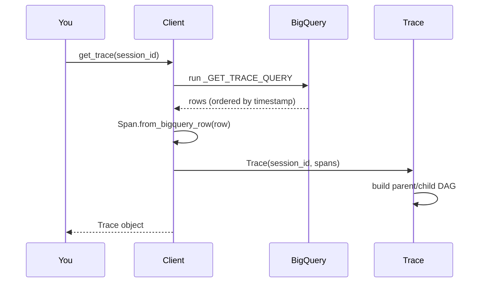
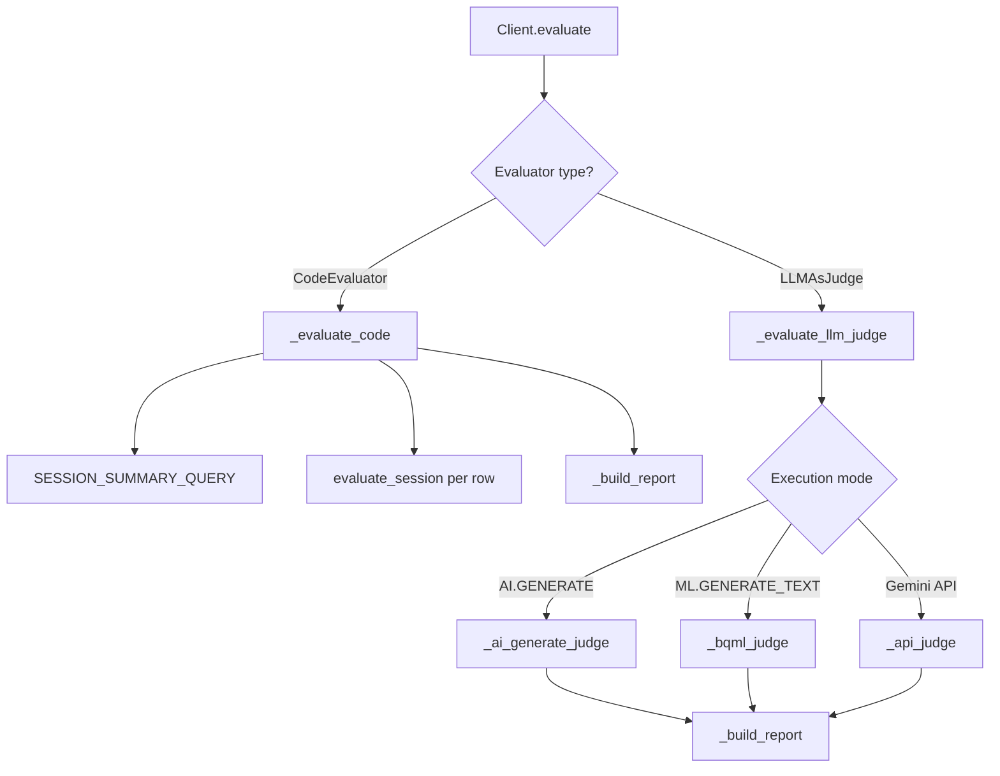
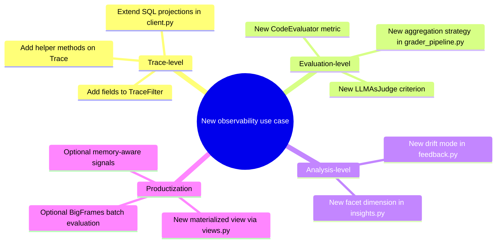
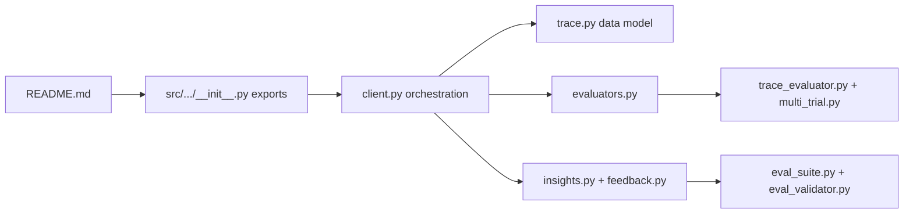

# Agent Observability Ramp-Up Guide

This guide gives a diagram-first map of the SDK so you can quickly add new **agent observability** use cases.

## 1) Big picture: what this SDK is

## 2) Package map (where to read first)

## 3) Request path: `Client.get_trace(session_id)`

## 4) Evaluation path: code vs LLM judge

## 5) Observability extension points for your new use case

## 6) Recommended learning order (fastest ramp-up)

## 7) First implementation checklist for a new observability use case

- Define the smallest user-facing API on `Client` (single clear method).
- Reuse `TraceFilter` and existing SQL template style for query safety.
- Return dataclasses (or report objects) with `summary()` methods.
- Add unit tests in `tests/` mirroring existing naming patterns.
- If the use case is evaluative, support both standalone and pipeline composition.
